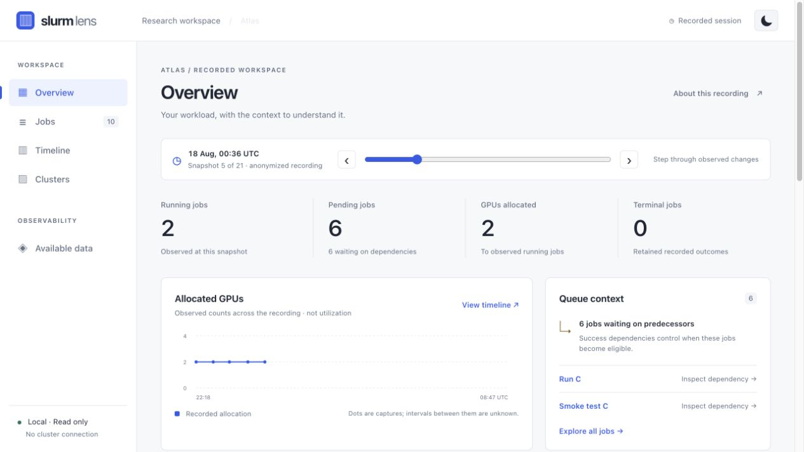
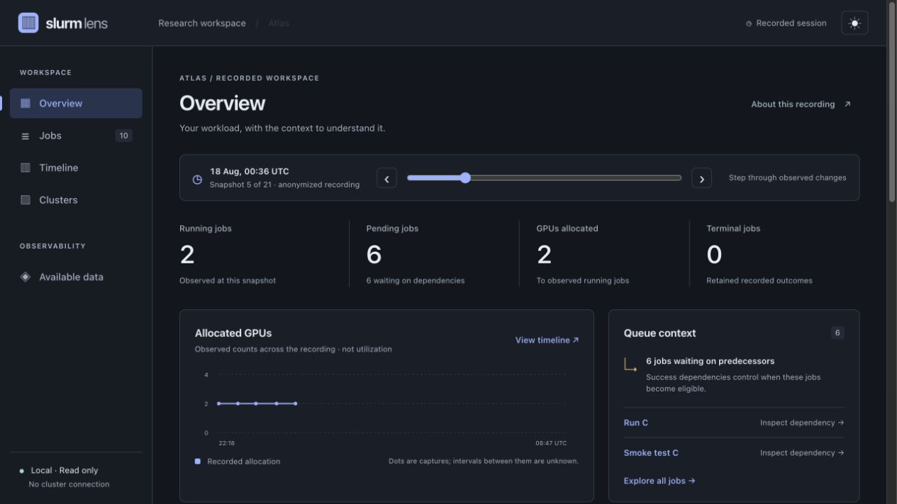

# Slurm Lens

[](https://github.com/SebastianBoehler/slurm-lens/actions/workflows/ci.yml)
[](LICENSE)

A lightweight Rust dashboard for Slurm jobs, node inventory, and hardware metrics.
Follow live observations from Slurm REST and Prometheus, pause to inspect history,
or explore an offline recording.

**Live connections and recording playback are separate modes.** The default opens
an anonymized recording; live mode requires your own configured endpoints. This
project is read-only and does not submit or cancel jobs.



<details>
<summary>Dark theme</summary>



</details>

[Browse all pages in light and dark themes](docs/screenshots.md).

## Run

Requires a current stable Rust toolchain (tested with Rust 1.98).

```sh
git clone https://github.com/SebastianBoehler/slurm-lens.git
cd slurm-lens
cargo run --release --locked
```

Open **http://127.0.0.1:4317**. The server binds only to loopback. Stop with Ctrl+C.
All assets and the example recording are embedded in the binary; it can be run
from any directory. No Node runtime, frontend build, or CDN is required. Recording
mode is offline; live mode connects only to the configured upstream services.

To load a different recording in the [version 1 format](docs/recordings.md):

```sh
cargo run --release -- --data ./local/session.json
```

Malformed recordings fail with an error; they are not replaced with example data.
Keep private recordings in the gitignored `local/` directory.

## Connect live

Copy [the connection example](examples/connection.json) to `local/connection.json`,
set the exact cluster, endpoints and Slurm user, and supply the named credential
environment variables. The first adapter supports **Slurm REST v0.0.45**. Prometheus
is optional. See [live setup and deployment boundaries](docs/live.md).

```sh
cargo run --release --locked -- --live local/connection.json
```

The backend collects once per interval and shares its cache through server-sent
events. Use **Pause live updates**, the history chart, and **Back to live** to
inspect observations without stopping collection. Errors and stale data stay
visible. History is bounded and in memory; export it before stopping the process.

## Try the included recording

1. Choose the first time in **Inspect observation**, then open **Jobs**, select **Pending**, and search for `Run C`.
2. Select the job to see its requested resources and success dependency.
3. Follow **Smoke test C** in the inspector to trace the predecessor chain.
4. Open **Timeline** and select observations in **Workload history**.
5. Open **Clusters** to see the observed nodes and allocated resources.
6. Toggle the moon/sun button; the light/dark preference persists locally.
7. Open **Available data** for provenance, limitations, and a recording export.

## Workload by account or user

The history panel compares jobs, running jobs, pending jobs and allocated GPUs
by Slurm account or job owner at the selected observation. **Group by** switches
the rows; **Show metric** selects the comparison bars. Totals cover visible jobs
only and exclude stale observations. Missing GPU allocations are marked incomplete.

Live collection retains the optional `user_name` field from
[Slurm REST job responses](https://slurm.schedmd.com/rest_api.html). Older recordings
without owners show **Not reported**; no identity is inferred from the account.
An account is a scheduling/accounting group and may contain several users.
These are allocation counts, not GPU utilization or billed GPU-hours.

## Pages

| Page | What you can explore |
| --- | --- |
| Overview | Recorded job counts and sampled GPU allocations |
| Jobs | State filters, search, resource requests, and job inspection |
| Timeline | Time on the vertical axis, node allocation lanes horizontally |
| Clusters | Nodes observed in the recording and their allocations |
| Available data | Provenance, coverage, limitations, and JSON export |
| Job inspector | Resources, dependency links, and recorded timing |

## Recording boundaries

- The example has 21 captures and 10 observed jobs from one overnight workload.
- Node lanes group recorded allocations. Concurrent allocations are packed into
  visual columns; those columns **are not physical GPU identities**.
- GPU counts and RAM requests are allocations, not measured utilization.
- No complete node inventory, hardware health, or other users' jobs is included.
- Dependencies are retained when previously observed, even after the scheduler
  clears satisfied conditions. Conditions missed before recording remain unknown.
- Terminal jobs remain visible with their last observation time. A stale running
  observation is marked as such and excluded from current allocation counts.
- The allocation chart shows sampled counts. Between-capture transitions and
  future placement are not inferred.

## Implementation

Rust uses Axum/Tokio for HTTP and streaming, and Reqwest with Rustls for upstream
HTTPS. Native ES modules, semantic HTML, CSS and SVG render the interface without
a frontend framework or build step. Recording mode fetches once; live mode uses
one shared collector and a browser event stream. The process never launches shell
commands. Only GET and HEAD requests are accepted.

The service binds to loopback. It is suitable for a single operator or private
tunnel; shared-user authentication and public deployment are not implemented.

Accessibility includes keyboard-operable controls, visible focus, text alongside
status colors, a focus-contained native job dialog, reduced-motion support and
a job table as an alternative to the timeline. This is not an accessibility
conformance certification.

## Development

```sh
cargo fmt --check
cargo clippy --all-targets -- -D warnings
cargo test
npm test
```

Node is used only for dependency-free frontend tests. Rust embeds assets at
compile time: rebuild/restart the server and reload the page after editing them.

The local HTTP integration check is `python3 tests/live_http.py` after a release
build, with port 4317 free. It tests protocol fixtures, not a production cluster.
See [live documentation](docs/live.md) for supported sources and current limits.

## Contributing

See [CONTRIBUTING.md](CONTRIBUTING.md) for the project layout, checks, and data
privacy expectations. Report bugs or propose improvements through
[GitHub issues](https://github.com/SebastianBoehler/slurm-lens/issues).
See [verification notes](docs/verification.md) for the initial checks and local
performance measurements.

Licensed under the [MIT License](LICENSE).
